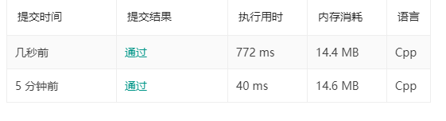

# 1163. 按字典序排在最后的子串

```c++
给你一个字符串 s，找出它的所有子串并按字典序排列，返回排在最后的那个子串。

 

示例 1：

输入："abab"
输出："bab"
解释：我们可以找出 7 个子串 ["a", "ab", "aba", "abab", "b", "ba", "bab"]。按字典序排在最后的子串是 "bab"。
示例 2：

输入："leetcode"
输出："tcode"
 

提示：

1 <= s.length <= 4 * 10^5
s 仅含有小写英文字符。

来源：力扣（LeetCode）
链接：https://leetcode-cn.com/problems/last-substring-in-lexicographical-order
著作权归领扣网络所有。商业转载请联系官方授权，非商业转载请注明出处。
```

---

后缀树算法       ×

学习STL API  √

string_view 不涉及字符串的拷贝，节约大量的时间和内存。

lexicographical_compare是STL中提供的字符串字典序比较器

如果将`if(lexicographical_compare(result.begin(),result.end(),i,str.end()))`

改为`if(result< i)`,则结果会相差10多倍。



```c++
class Solution {
public:
    string lastSubstring(string s) {
        stack<string_view> substrs;
        string_view str(s);
        string_view result=str;
        for(auto i=str.begin()+1;i!=str.end();i++){
            if(*i<=*(i-1)){
                continue;
            }
            if(lexicographical_compare(result.begin(),result.end(),i,str.end())){
                result=str.substr(i-str.begin());
            }
        }
        return (string)result;
    }
};

```

---

