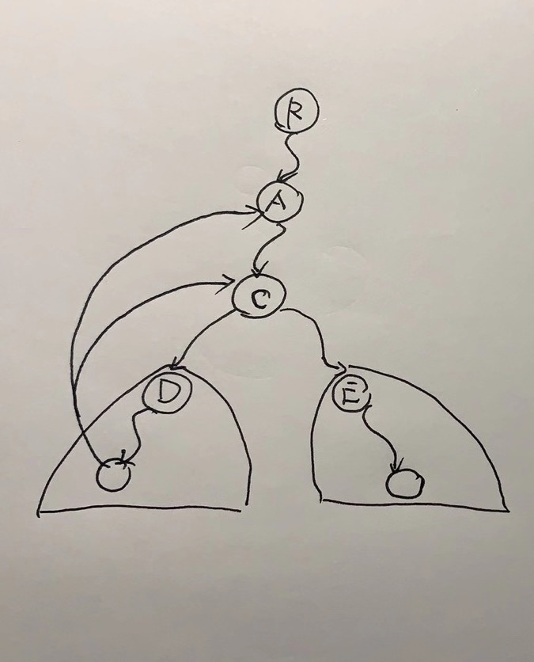

# 1192. 查找集群内的「关键连接」

```c++
力扣数据中心有 n 台服务器，分别按从 0 到 n-1 的方式进行了编号。

它们之间以「服务器到服务器」点对点的形式相互连接组成了一个内部集群，其中连接 connections 是无向的。

从形式上讲，connections[i] = [a, b] 表示服务器 a 和 b 之间形成连接。任何服务器都可以直接或者间接地通过网络到达任何其他服务器。

「关键连接」是在该集群中的重要连接，也就是说，假如我们将它移除，便会导致某些服务器无法访问其他服务器。

请你以任意顺序返回该集群内的所有 「关键连接」。

 

示例 1：


输入：n = 4, connections = [[0,1],[1,2],[2,0],[1,3]]
输出：[[1,3]]
解释：[[3,1]] 也是正确的。
 

提示：

1 <= n <= 10^5
n-1 <= connections.length <= 10^5
connections[i][0] != connections[i][1]
不存在重复的连接

来源：力扣（LeetCode）
链接：https://leetcode-cn.com/problems/critical-connections-in-a-network
著作权归领扣网络所有。商业转载请联系官方授权，非商业转载请注明出处。
```

---

来源[@cnspary](https://leetcode-cn.com/problems/critical-connections-in-a-network/solution/ben-ti-shi-zhi-shi-bccshuang-lian-tong-fen-liang-b/)  的解题

tarjan算法


我们考虑 C 的两颗子树

1.观察D所在的子树 其内部的某个节点 可以访问到 C的祖先 或 C本身 那么 CD 断开 并不影响整个图的连通性
2.观察E所在的子树 其内部的任何节点 无法访问到 C的祖先 和 C本身 那么 CE 断开 E所在的子树 必然脱离整体




作者：cnspary
链接：https://leetcode-cn.com/problems/critical-connections-in-a-network/solution/ben-ti-shi-zhi-shi-bccshuang-lian-tong-fen-liang-b/
来源：力扣（LeetCode）
著作权归作者所有。商业转载请联系作者获得授权，非商业转载请注明出处。

```c++
class Solution {
public:
    vector<vector<int>> Graph;
    vector<int> visited;   // 标记一个节点是否已经被访问
    vector<int> visitTime; // 节点的访问时间， 时间越小代表访问越早
    vector<int> Highestparent; // 节点可以访问到 最早 祖先
    vector<vector<int>> ans;

    int dfs(int node, int parent, int &clock) {
        visited[node] = 1;

        // 设置 节点的访问时间 并初始化该节点能访问到的最早祖先为该节点自己
        visitTime[node] = Highestparent[node] = clock; 

        for (int i = 0; i < Graph[node].size(); ++i) {
            if (Graph[node][i] != parent) { // 确保 dfs 是往更深处查询

                if (visited[Graph[node][i]] == 0) {  // 该节点还未被访问

                    // node的子节点能访问到的最早祖先, hp越小 表示 越早
                    int hp = dfs(Graph[node][i], node, ++clock); 

                    // 若该最早祖先 比 node 访问的还要早 则更新node所能访问到的最早祖先 
                    // 举个例子：比如 0 -> 1 -> 2 -> 0 显然 2 可以访问到 0, 由于 2 又是 1 的子节点 则 1 定能访问到 0
                    Highestparent[node] = min(Highestparent[node], hp); 

                    // 如果子节点 所能访问到的最早祖先 不早于 node 那么 node 与 该子节点的边 必然是关键路径
                    if (hp > visitTime[node]) 
                        ans.push_back({node, Graph[node][i]});

                } else // 该节点已经访问过 直接更新
                    Highestparent[node] = min(Highestparent[node], Highestparent[Graph[node][i]]);
            }
        }

        return Highestparent[node];
    }

    vector<vector<int>> criticalConnections(int n, vector<vector<int>> &connections) {
        Graph = vector<vector<int>>(n);
        visited = vector<int>(n, 0);
        visitTime = vector<int>(n, 0);
        Highestparent = vector<int>(n, 0);
        ans = vector<vector<int>>();

        for (int i = 0; i < connections.size(); ++i) {
            Graph[connections[i][0]].push_back(connections[i][1]);
            Graph[connections[i][1]].push_back(connections[i][0]);
        }

        int clock = 0;
        dfs(0, -1, clock);
        return ans;
    }
};
```

---


