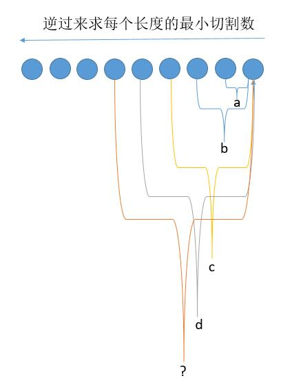
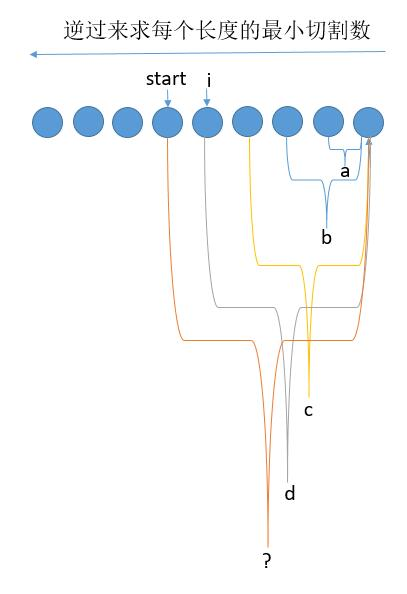
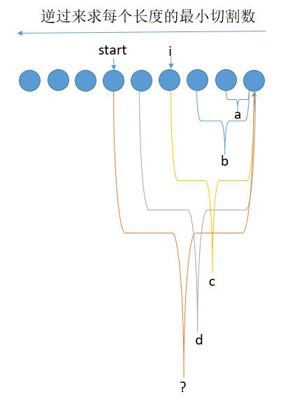

# 132. 分割回文串 II

```c++
给定一个字符串 s，将 s 分割成一些子串，使每个子串都是回文串。

返回符合要求的最少分割次数。

示例:

输入: "aab"
输出: 1
解释: 进行一次分割就可将 s 分割成 ["aa","b"] 这样两个回文子串。

来源：力扣（LeetCode）
链接：https://leetcode-cn.com/problems/palindrome-partitioning-ii
著作权归领扣网络所有。商业转载请联系官方授权，非商业转载请注明出处。
```

---

```c++
class Solution {
public:
	int minCut(string s) {
		int n = s.size();
		vector<int> f(n+1); //f[i]表示区间[i, n - 1]内最小的分割数（即从i到末尾的最小分割数）
		vector<vector<bool>> dp(n, vector<bool>(n, false));  //表示区间[i,j]是否是回文

		for (int i = 0; i <= n; ++i)//初始化f，最坏的情况下要分隔 n - 1 - i 次
			f[i] = n - 1 - i;

		for (int i = n - 1; i >= 0; --i)  //i 从后往前
		{
			for (int j = i; j < n; ++j)   //i 从i到末尾
			{
				if (s[i] == s[j] && (j - i < 2 || dp[i + 1][j - 1] == true))    //此时s[i,j]为回文
				{
					dp[i][j] = true;
					//当string[i:j]是回文，那么最小分割数就等于他自身或者[j+1:n]的最小分割数+1
					f[i] = min(f[i], f[j + 1] + 1);
				}
			}
		}
		return f[0];
	}
};

```

---

解题过程中，使用过两次动态规划，分别是存储是否为回文字符串的`dp[i][j]`，和存储子串的最小分割次数`f`。

具体思路如下图组（<https://leetcode-cn.com/problems/palindrome-partitioning-ii/solution/xiang-xi-tong-su-de-si-lu-fen-xi-duo-jie-fa-by-3-8/）：>



如上图，图中 a,b,c,d 表示括起来的字符串的最小切割次数。此时需要求问号处括起来的字符串的最小切割次数,使用`f[i] = min(f[i], f[j + 1] + 1);`。



如下图，先判断 start 到 i 是否是回文串，如果是的话，就用 1 + d 和之前的 min 比较



如下图，i 后移，继续判断 start 到 i 是否是回文串，如果是的话，就用 1 + c 和之前的 min 比较。

然后 i 继续后移重复上边的过程。每次选一个较小的切割次数，最后问号处就求出来了。

接着 start 继续前移，重复上边的过程，直到求出 start 等于 0 的最小切割次数就是我们要找的了

---

## 另一种解法

>如果从分割字符串的角度考虑这个问题的话，对于一个区间内的字符串来说，每一个位置都将是可能的分割点，可以用暴力递归的方式找出答案，但是时间复杂度太高，加上预处理回文数组能勉强通过。 换个角度想想，当切割次数最少使得切割后的所有字符串都是回文时，也正是这些回文子串最长的时候，那么如果说能找到以每个字符为中心的最长回文串，实际上就已经找到了答案。

```java
public int minCut(String s) {
        if(s == null || s.length() <= 1)
            return 0;
        int len = s.length();
        int dp[] = new int[len];
        Arrays.fill(dp, len-1);
        for(int i = 0; i < len; i++){
            // 注意偶数长度与奇数长度回文串的特点
            mincutHelper(s , i , i , dp);  // 奇数回文串以1个字符为中心
            mincutHelper(s, i , i+1 , dp); // 偶数回文串以2个字符为中心
        }
        return dp[len-1];
    }
    private void mincutHelper(String s, int i, int j, int[] dp){
        int len = s.length();
        while(i >= 0 && j < len && s.charAt(i) == s.charAt(j)){
            dp[j] = Math.min(dp[j] , (i==0?-1:dp[i-1])+1);
            i--;
            j++;
        }
    }
```
