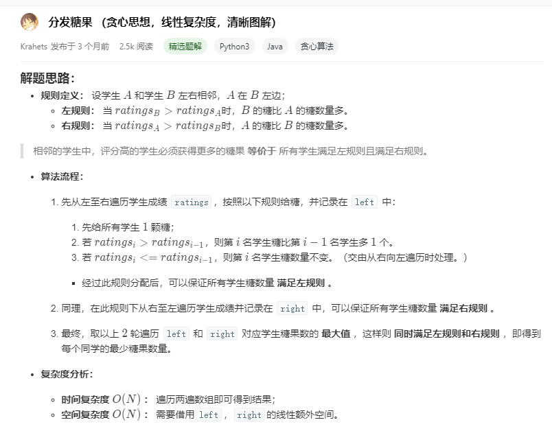

# 135. 分发糖果

```c++
老师想给孩子们分发糖果，有 N 个孩子站成了一条直线，老师会根据每个孩子的表现，预先给他们评分。

你需要按照以下要求，帮助老师给这些孩子分发糖果：

每个孩子至少分配到 1 个糖果。
相邻的孩子中，评分高的孩子必须获得更多的糖果。
那么这样下来，老师至少需要准备多少颗糖果呢？

示例 1:

输入: [1,0,2]
输出: 5
解释: 你可以分别给这三个孩子分发 2、1、2 颗糖果。
示例 2:

输入: [1,2,2]
输出: 4
解释: 你可以分别给这三个孩子分发 1、2、1 颗糖果。
     第三个孩子只得到 1 颗糖果，这已满足上述两个条件。

来源：力扣（LeetCode）
链接：https://leetcode-cn.com/problems/candy
著作权归领扣网络所有。商业转载请联系官方授权，非商业转载请注明出处。
```

---

```c++
class Solution {
public:
	int candy(vector<int>& ratings) {
		int ans = 1;
		int temp = ratings[0];  //存储上一个人的表现值
		int cand = 1;  //存储上一个人的糖果值
		int deCount = 0; //统计连续降序长度

		for (int i = 1; i < ratings.size(); i++) {
			if (ratings[i] >= temp) {   //比上一个人表现好，糖果因该加
				if (deCount > 0) {
					ans += (1 + deCount) * deCount / 2;
					if (deCount >= cand)
						ans += deCount - cand + 1;
					cand = 1;
					deCount = 0;
				}
				cand = temp == ratings[i] ? 1 : cand + 1;
				ans += cand;

			}
			else {
				deCount++;
			}

			temp = ratings[i];
		}

		if (deCount > 0) {
			ans += ((1 + deCount) * deCount) / 2;
			if (deCount >= cand) 
				ans += (deCount - cand + 1);
		}

		return ans ;
	}
};
```

---

三种情况分开讨论：

1. `ratings[i - 1] == ratings[i]`，那么我们只需要 1 糖果

2. `ratings[i - 1] < ratings[i]`，那么我们只需要比前一个多一块糖果

3. `ratings[i - 1] > ratings[i]`，记录递减的值，使用等差数列求和公式求得递减数列总和

4. ！，有时候递减的数列太长了，导致第一个过大，则对递减的前一个做一个补偿:(`ans += deCount - cand + 1;`)


---

## 还有一种基于贪心算法的解法：




```python
class Solution:
    def candy(self, ratings: List[int]) -> int:
        left = [1 for _ in range(len(ratings))]
        right = left[:]
        for i in range(1, len(ratings)):
            if ratings[i] > ratings[i - 1]: left[i] = left[i - 1] + 1
        count = left[-1]
        for i in range(len(ratings) - 2, -1, -1):
            if ratings[i] > ratings[i + 1]: right[i] = right[i + 1] + 1
            count += max(left[i], right[i])
        return count

作者：jyd
链接：https://leetcode-cn.com/problems/candy/solution/candy-cong-zuo-zhi-you-cong-you-zhi-zuo-qu-zui-da-/
来源：力扣（LeetCode）
著作权归作者所有。商业转载请联系作者获得授权，非商业转载请注明出处。
```
