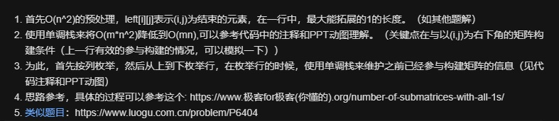

# 1504. 统计全 1 子矩形

```c++
给你一个只包含 0 和 1 的 rows * columns 矩阵 mat ，请你返回有多少个 子矩形 的元素全部都是 1 。

 

示例 1：

输入：mat = [[1,0,1],
            [1,1,0],
            [1,1,0]]
输出：13
解释：
有 6 个 1x1 的矩形。
有 2 个 1x2 的矩形。
有 3 个 2x1 的矩形。
有 1 个 2x2 的矩形。
有 1 个 3x1 的矩形。
矩形数目总共 = 6 + 2 + 3 + 1 + 1 = 13 。
示例 2：

输入：mat = [[0,1,1,0],
            [0,1,1,1],
            [1,1,1,0]]
输出：24
解释：
有 8 个 1x1 的子矩形。
有 5 个 1x2 的子矩形。
有 2 个 1x3 的子矩形。
有 4 个 2x1 的子矩形。
有 2 个 2x2 的子矩形。
有 2 个 3x1 的子矩形。
有 1 个 3x2 的子矩形。
矩形数目总共 = 8 + 5 + 2 + 4 + 2 + 2 + 1 = 24 。
示例 3：

输入：mat = [[1,1,1,1,1,1]]
输出：21
示例 4：

输入：mat = [[1,0,1],[0,1,0],[1,0,1]]
输出：5
 

提示：

1 <= rows <= 150
1 <= columns <= 150
0 <= mat[i][j] <= 1

来源：力扣（LeetCode）
链接：https://leetcode-cn.com/problems/count-submatrices-with-all-ones
著作权归领扣网络所有。商业转载请联系官方授权，非商业转载请注明出处。
```

---

先按照统计全1的正方形的方法写了一个长方形的，

主要思路是设置4个dp数组，分别表示该点左边有多少个连续的1，该点上边有多少个1. 该点能组成的最大长方形的左上坐标在哪。

感觉过于繁琐（应为一个点可以对应多个长方形，所以不好dp）

所以n^2的算法只用dp不是很好实现，可以使用一个n^3的算法来解题。

只用一个dp数组，`dp[i][j]` 表示`[i，j]`位置上左边有多少个连续的1

遍历`i，j`，然后尝试朝上数就行，为0的时候提前退出。

```c++
class Solution {
public:
    int numSubmat(vector<vector<int>>& mat) {
        int n = mat.size();
        int m = mat[0].size();
        // dp[i][j] 表示 [i，j ]位置上左边有多少个连续的1
        vector<vector<int> > dp(n, vector<int>(m));
        for (int i = 0; i < n; i++) {
            for (int j = 0, acc = 0; j < m; j++) {
                if (mat[i][j] == 1) acc++;
                else acc = 0;
                dp[i][j] = acc;
            }
        }
        int ans = 0;
        for (int i = 0; i < n; i++) {
            for (int j = 0; j < m; j++) {
                int minx = 0x3f3f3f3f;
                for (int k = i; k >= 0; k--) {
                    // 朝上数
                    minx = min(dp[k][j], minx);
                    ans += minx;
                    if (minx == 0) break;
                }
            }
        }
        return ans;
    }
};
```

---

还有一个基于单调栈的写法，来源于解题区的[@joseph1314](https://leetcode-cn.com/u/joseph1314/)



```c++
class Solution {
    public int numSubmat(int[][] mat) {
        int n = mat.length;
        int m = mat[0].length;
        int[][] left = new int[n + 1][m + 1];
        int res = 0;
        for (int i = 1; i <= n; i++) {
            int now = 0;
            for (int j = 1; j <= m; j++) {
                if (mat[i - 1][j - 1] == 1) now++;
                else now = 0;
                left[i][j] = now;
            }
        }
        //首先按列枚举
        for (int j = 1; j <= m; j++) {
            int to_sum = 0;//每个顶点(i,j)为矩阵右下角的矩阵个数，动态更新。
            //栈里元素int[]=<当前的栈顶元素的向左能过延伸的最长长度，被push进栈的元素中，大于栈顶元素的个数>
            Stack<int[]> stack = new Stack<>();
            for (int i = 1; i <= n; i++) {
                int cnt = 0;//计算当前要被push进栈的left[i][j]之前，栈中有多少元素大于left[i][j]
                while (!stack.isEmpty() && stack.peek()[0] > left[i][j]) {
                    //把栈中永不会参与到(i,j)为右下角元素的构建那些矩阵单元去掉（参考PPT的动态）
                    //去掉的过程相当于对栈中元素进行了修剪对齐（使之单调）（见ppT动图）
                    to_sum -= (stack.peek()[1] + 1) * (stack.peek()[0] - left[i][j]);
                    cnt +=stack.peek()[1]+1; // 大于当前left[i][j] 的栈中元素个数 计数
                    stack.pop();
                }
                to_sum+=left[i][j];
                res+=to_sum;
                stack.push(new int[]{left[i][j],cnt});
            }
        }
        return res;
        
    }
}

作者：Joseph1314
链接：https://leetcode-cn.com/problems/count-submatrices-with-all-ones/solution/dan-diao-zhan-si-xiang-dong-tu-li-jie-onmfu-za-du-/
来源：力扣（LeetCode）
著作权归作者所有。商业转载请联系作者获得授权，非商业转载请注明出处。
```