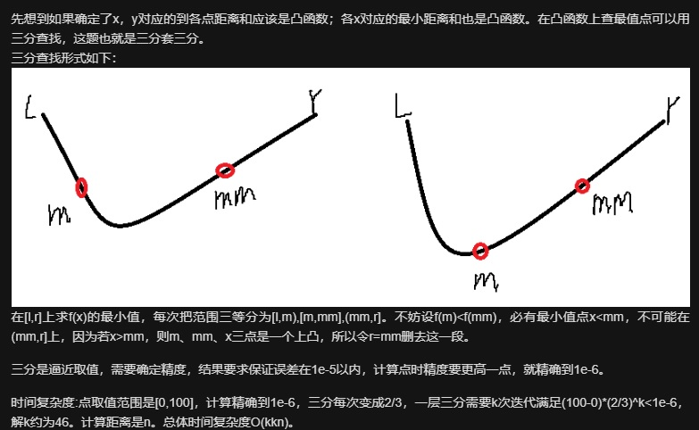

# 1515. 服务中心的最佳位置

```c++
一家快递公司希望在新城市建立新的服务中心。公司统计了该城市所有客户在二维地图上的坐标，并希望能够以此为依据为新的服务中心选址：使服务中心 到所有客户的欧几里得距离的总和最小 。

给你一个数组 positions ，其中 positions[i] = [xi, yi] 表示第 i 个客户在二维地图上的位置，返回到所有客户的 欧几里得距离的最小总和 。

换句话说，请你为服务中心选址，该位置的坐标 [xcentre, ycentre] 需要使下面的公式取到最小值：


与真实值误差在 10^-5 之内的答案将被视作正确答案。

 

示例 1：


输入：positions = [[0,1],[1,0],[1,2],[2,1]]
输出：4.00000
解释：如图所示，你可以选 [xcentre, ycentre] = [1, 1] 作为新中心的位置，这样一来到每个客户的距离就都是 1，所有距离之和为 4 ，这也是可以找到的最小值。
示例 2：


输入：positions = [[1,1],[3,3]]
输出：2.82843
解释：欧几里得距离可能的最小总和为 sqrt(2) + sqrt(2) = 2.82843
示例 3：

输入：positions = [[1,1]]
输出：0.00000
示例 4：

输入：positions = [[1,1],[0,0],[2,0]]
输出：2.73205
解释：乍一看，你可能会将中心定在 [1, 0] 并期待能够得到最小总和，但是如果选址在 [1, 0] 距离总和为 3
如果将位置选在 [1.0, 0.5773502711] ，距离总和将会变为 2.73205
当心精度问题！
示例 5：

输入：positions = [[0,1],[3,2],[4,5],[7,6],[8,9],[11,1],[2,12]]
输出：32.94036
解释：你可以用 [4.3460852395, 4.9813795505] 作为新中心的位置
 

提示：

1 <= positions.length <= 50
positions[i].length == 2
0 <= positions[i][0], positions[i][1] <= 100

来源：力扣（LeetCode）
链接：https://leetcode-cn.com/problems/best-position-for-a-service-centre
著作权归领扣网络所有。商业转载请联系官方授权，非商业转载请注明出处。
```

---

比较有意思的一道题，关键在于解法多样

这里选一种比较好理解的三分法（前提是要求优化的函数为凸函数）



（图片来自 [@lyhshang](https://leetcode-cn.com/u/lyhshang/)）

```c++

class Solution {
    double cal(double x, double y, vector<vector<int> >& A)
    {
        int n = A.size();
        double ans = 0;
        for (int i = 0; i < n; ++i)
            ans += sqrt((x - A[i][0]) * (x - A[i][0]) + (y - A[i][1]) * (y - A[i][1]));
        return ans;
    }
    double cal2(double x, vector<vector<int> >& A)
    {
        double l = 0, r = 100;
        for (int i = 1; i <= 100; ++i)
        {
            double mid1 = (l + r) / 2;
            double mid2 = (mid1 + r) / 2;
            if (cal(x, mid1, A) > cal(x, mid2, A)) l = mid1;
            else r = mid2;
        }
        return cal(x, l, A);
    }
public:
    double getMinDistSum(vector<vector<int>>& A) {
        double l = 0, r = 100;
        for (int i = 1; i <= 100; ++i)
        {
            double mid1 = (l + r) / 2;
            double mid2 = (mid1 + r) / 2;
            if (cal2(mid1, A) > cal2(mid2, A)) l = mid1;
            else r = mid2;
        }
        return cal2(l, A);
    }
};


```

---

除此之外，还有 **梯度下降**，**模拟退火** 等等算法

