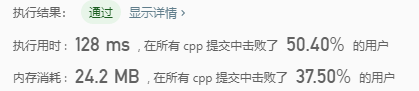
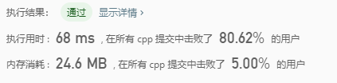
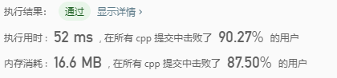
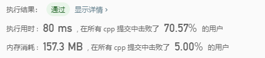
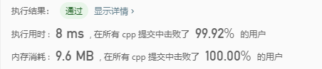

# 187-重复的DNA序列

```c++
所有 DNA 都由一系列缩写为 A，C，G 和 T 的核苷酸组成，例如：“ACGAATTCCG”。在研究 DNA 时，识别 DNA 中的重复序列有时会对研究非常有帮助。

编写一个函数来查找 DNA 分子中所有出现超过一次的 10 个字母长的序列（子串）。

 

示例：

输入：s = "AAAAACCCCCAAAAACCCCCCAAAAAGGGTTT"
输出：["AAAAACCCCC", "CCCCCAAAAA"]

来源：力扣（LeetCode）
链接：https://leetcode-cn.com/problems/repeated-dna-sequences
著作权归领扣网络所有。商业转载请联系官方授权，非商业转载请注明出处。
```

---

此题解法比较简单，这篇主要是探究不同解法对求解时间的影响。

---
## 解法1，使用简单的map<string,int>

使用c++  STL中的 map 容器

结果：



```c++
class Solution {
public:
	vector<string> findRepeatedDnaSequences(string s) {

		map<string, int> m;
		vector<string> ans;
		if (s.size() <= 10)
			return ans;
		for (int i = 0; i <= s.size() -10; i++) {
			++m[s.substr(i, 10)];
		}
		for (auto kv : m) {
			if (kv.second > 1) {
				ans.push_back(kv.first);
			}
		}
		return ans;
	}
};
```
---

## 解法2，使用 unorder_map<string,int>

C++中， map 使用红黑树实现，有点事占用空间小，但是查询和插入的时间的都是logn

unorder_map使用的是hash表，占用空间较大，在数据密集的时候性能退化明显，但是插入和查询都很快。

结果：



```c++
class Solution {
public:
	vector<string> findRepeatedDnaSequences(string s) {

		unordered_map<string, int> m;
		vector<string> ans;
		if (s.size() <= 10)
			return ans;
		for (int i = 0; i <= s.size() -10; i++) {
			++m[s.substr(i, 10)];
		}
		for (auto kv : m) {
			if (kv.second > 1) {
				ans.push_back(kv.first);
			}
		}
		return ans;
	}
};
```
---

## 解法3，将string 通过位运算转为数字，然后使用 unorder_map<int,int>

ATCG 用一个2位的数就可以表示，10个的话用20位足够，int就可以，先将string转为int，然后使用unordered_map<int, int> m;
最后统计结果的时候将原数字还原回来，



```c++
class Solution {
public:
	vector<string> findRepeatedDnaSequences(string s) {

		unordered_map<int, int> m;
		unordered_map<char, int> mp{ {'A', 0}, {'C', 1}, {'G', 2}, {'T', 3} };
		unordered_map<int, char > mp2{ {0,'A'},{1,'C'},{2,'G'},{3,'T'} };

		vector<string> ans;
		int val = 0, mask = (1 << 20) - 1; //mask等于二进制的20个1
		if (s.size() <= 10)
			return ans;

		for (int i = 0; i < 10; ++i) 
			val = (val << 2) | mp[s[i]];
		m[val] = 1;
		for (int i = 10; i < s.size(); i++) {
			val = ((val << 2) & mask) | mp[s[i]]; //去掉左移的一个字符再加上一个新字符
			++m[val];
		}


		for (auto kv : m) {
			if (kv.second > 1) {
				string t(10,'0');
				int val = kv.first;
				for (int j = 9; j >= 0; j--) {
					int a = val & 3;
					val >>= 2;
					t[j] = mp2[a];
				}
				ans.push_back(t);
			}
		}
		return ans;
	}
};
```
---

## 解法4，将string 通过位运算转为数字，然后使用 vector

与上一种解法的主要区别是用vector代替之前的map，加快速度，但是内存要消耗不少。



```c++
class Solution {
public:
	vector<string> findRepeatedDnaSequences(string s) {

		vector<int>m(1 << 20, 0);
		unordered_map<char, int> mp{ {'A', 0}, {'C', 1}, {'G', 2}, {'T', 3} };
		unordered_map<int, char > mp2{ {0,'A'},{1,'C'},{2,'G'},{3,'T'} };

		vector<string> ans;
		int val = 0, mask = (1 << 20) - 1; //mask等于二进制的20个1
		if (s.size() <= 10)
			return ans;

		for (int i = 0; i < 10; ++i) 
			val = (val << 2) | mp[s[i]];
		m[val] = 1;
		for (int i = 10; i < s.size(); i++) {
			val = ((val << 2) & mask) | mp[s[i]]; //去掉左移的一个字符再加上一个新字符
			if (m[val] > 1) {
				continue;
			}
			if (m[val] == 1) {
				ans.push_back(s.substr(i - 10 + 1,10));
			}
			++m[val];
		}


		return ans;
	}
};
```
---

## 解法5，将string 通过位运算转为数字，然后使用 bitset记录是否出现过该字符串

bitset的长度位1 << 20，该位为0表示该字符串还没出现过，为1表示已经出现过。

bitset可以大大减少内存消耗，并且寻址的时间也大大缩短



```c++
class Solution {
public:
    vector<string> findRepeatedDnaSequences(string s) {
        //对应二进制00, 01, 10, 11.那么10个组合只要20位就够了。
        unordered_map<char, int> m{{'A', 0}, {'C', 1}, {'G', 2}, {'T', 3}};
        vector<string> res;
        bitset<1 << 20> s1, s2; //那么所有组合的值将在0到(1 << 20 - 1)之间
        int val = 0, mask = (1 << 20) - 1; //mask等于二进制的20个1
        //类似与滑动窗口先把前10个字母组合
        for (int i = 0; i < 10; ++i) val = (val << 2) | m[s[i]];
        s1.set(val); //置位
        for (int i = 10; i < s.size(); ++i) {
            val = ((val << 2) & mask) | m[s[i]]; //去掉左移的一个字符再加上一个新字符
            if (s2.test(val)) continue; //出现过两次跳过
            if (s1.test(val)) {
                res.push_back(s.substr(i - 9, 10));
                s2.set(val);
            }
            else s1.set(val);
        }
        return res;
    }
};
```
---
