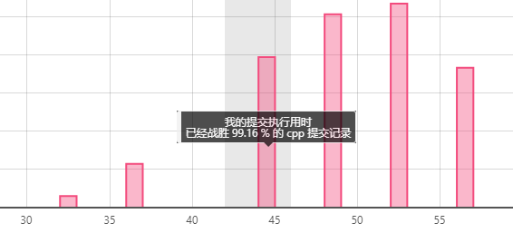

# 212. 单词搜索 II

```c++
给定一个二维网格 board 和一个字典中的单词列表 words，找出所有同时在二维网格和字典中出现的单词。

单词必须按照字母顺序，通过相邻的单元格内的字母构成，其中“相邻”单元格是那些水平相邻或垂直相邻的单元格。同一个单元格内的字母在一个单词中不允许被重复使用。

示例:

输入: 
words = ["oath","pea","eat","rain"] and board =
[
  ['o','a','a','n'],
  ['e','t','a','e'],
  ['i','h','k','r'],
  ['i','f','l','v']
]

输出: ["eat","oath"]
说明:
你可以假设所有输入都由小写字母 a-z 组成。

提示:

你需要优化回溯算法以通过更大数据量的测试。你能否早点停止回溯？
如果当前单词不存在于所有单词的前缀中，则可以立即停止回溯。什么样的数据结构可以有效地执行这样的操作？散列表是否可行？为什么？ 前缀树如何？如果你想学习如何实现一个基本的前缀树，请先查看这个问题： 实现Trie（前缀树）。

来源：力扣（LeetCode）
链接：https://leetcode-cn.com/problems/word-search-ii
著作权归领扣网络所有。商业转载请联系官方授权，非商业转载请注明出处。
```

---

## 实现：使用前缀树+DFS



很明显，对于前缀相同的搜索，使用前缀树可以节省大量的时间。

使用前缀树的时候和DFS的时候，要特别注意使用

`board[x][y] = '#';//标记(x,y)对应的字符已被访问过，防止同一个单元格内的字符在一个单词中重复使用`

对进入递归的每个字符都做`trmpstr.push_back(temp);`，出递归时执行`trmpstr.pop_back();`。

## 源码（带主函数）

```c++
#include<iostream>
#include<vector>
#include<stack>
#include<queue>
#include<algorithm>
#include<string>
#include<map>
#include<unordered_map>
//#include<set>
using namespace std;

class Node {
public:
	//char val;
	Node* child[26] = { NULL };
	bool end = false;  //这是不是某个元素的最终节点
	bool has_child = false;  //还有没有其他
};

class Trie {
public:
	Node* root;
	/** Initialize your data structure here. */
	Trie() {
		root = new Node();
	}

	/** Inserts a word into the trie. */
	void insert(string word) {
		auto temp = root;
		for (int i = 0; i < word.size(); i++) {
			int offset = word[i] - 'a';
			if (temp->child[offset] == NULL) {  //此时这个节点还没有创建
				temp->child[offset] = new Node();
				temp->has_child = true;
				temp = temp->child[offset];
			}
			else {
				temp = temp->child[offset];
			}

		}
		temp->end = true;
	}

	/** Returns if the word is in the trie. */
	bool search(string word) {
		auto temp = root;
		for (int i = 0; i < word.size(); i++) {
			int offset = word[i] - 'a';
			if (temp->child[offset] == NULL) {  //此时这个节点还没有创建
				return false;
			}
			else {
				temp = temp->child[offset];
			}
		}
		return temp->end;
	}
};

class Solution {
public:
	vector<string> result;
	Trie* trie = new Trie();
	string trmpstr = "";
	vector<string> findWords(vector<vector<char>>& board, vector<string>& words) {
		
		
		for (auto &word : words)
			trie->insert(word);

		for (int i = 0; i < board.size(); i++)
			for (int j = 0; j < board[0].size(); j++)
				helper(board, trie->root, i, j);

		return result;
	}


	void helper(vector<vector<char>>& board, Node* node, int x, int y)
	{
		if (node->end == true) {//在board中找到words中一个单词，添加到result中
			node->end = false;//将该单词标记为false,防止在word中再次递归到这个单词，从而造成重复添加
			result.push_back(trmpstr);
			return;
		}
		if (x < 0 || x == board.size() || y < 0 || y == board[x].size())
			return;//超出边界,不能继续递归
		if (board[x][y] == '#' || node->child[board[x][y] - 'a'] == nullptr)
			return;//坐标(x,y)对应的字符不在前缀树中，递归方向不对，返回到上一个坐标
		node = node->child[board[x][y] - 'a'];//note指向下一个字符节点
		char temp = board[x][y];

		trmpstr.push_back(temp);
		board[x][y] = '#';//标记(x,y)对应的字符已被访问过，防止同一个单元格内的字符在一个单词中重复使用 !!!!(很关键)

		helper(board, node, x + 1, y);
		helper(board, node, x - 1, y);
		helper(board, node, x, y + 1);
		helper(board, node, x, y - 1);

		trmpstr.pop_back();
		board[x][y] = temp;
	}

};

int main()
{

	Solution s;
	vector<vector<char>> input1 = { {'o','a','a','n'},
									{'e','t','a','e'},
									{'i','h','k','r'},
									{'i','f','l','v'}};

	vector<string> input2 = { "oath","pea","eat","rain" };

	auto a = s.findWords(input1, input2);

	//for (auto t : a) {
	//	for (auto tt : t) {
	//		cout << tt << " , ";
	//	}
	//	cout << endl;
	//}

	for (auto t : a) {
		cout << t << " , ";
	}

	//cout << a << endl;

	return 0;
}

```

一共定义了trie节点（Node），trie树（Trie），解题类（Solution）三个类。

在实际使用中，为了体现本题的逐字符搜索（DFS）的特点，没有使用之前在Trie类中定义的函数，二而是使用了递归的helper函数来完成搜索。
