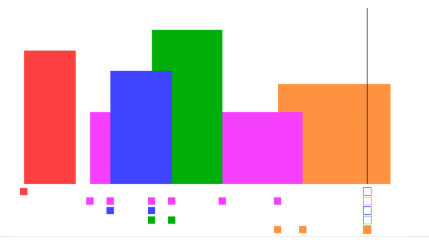

# 218. 天际线问题

```c++
城市的天际线是从远处观看该城市中所有建筑物形成的轮廓的外部轮廓。现在，假设您获得了城市风光照片（图A）上显示的所有建筑物的位置和高度，请编写一个程序以输出由这些建筑物形成的天际线（图B）。
```


```c++
每个建筑物的几何信息用三元组 [Li，Ri，Hi] 表示，其中 Li 和 Ri 分别是第 i 座建筑物左右边缘的 x 坐标，Hi 是其高度。可以保证 0 ≤ Li, Ri ≤ INT_MAX, 0 < Hi ≤ INT_MAX 和 Ri - Li > 0。您可以假设所有建筑物都是在绝对平坦且高度为 0 的表面上的完美矩形。

例如，图A中所有建筑物的尺寸记录为：[ [2 9 10], [3 7 15], [5 12 12], [15 20 10], [19 24 8] ] 。

输出是以 [ [x1,y1], [x2, y2], [x3, y3], ... ] 格式的“关键点”（图B中的红点）的列表，它们唯一地定义了天际线。关键点是水平线段的左端点。请注意，最右侧建筑物的最后一个关键点仅用于标记天际线的终点，并始终为零高度。此外，任何两个相邻建筑物之间的地面都应被视为天际线轮廓的一部分。

例如，图B中的天际线应该表示为：[ [2 10], [3 15], [7 12], [12 0], [15 10], [20 8], [24, 0] ]。

说明:

任何输入列表中的建筑物数量保证在 [0, 10000] 范围内。
输入列表已经按左 x 坐标 Li  进行升序排列。
输出列表必须按 x 位排序。
输出天际线中不得有连续的相同高度的水平线。例如 [...[2 3], [4 5], [7 5], [11 5], [12 7]...] 是不正确的答案；三条高度为 5 的线应该在最终输出中合并为一个：[...[2 3], [4 5], [12 7], ...]

来源：力扣（LeetCode）
链接：https://leetcode-cn.com/problems/the-skyline-problem
著作权归领扣网络所有。商业转载请联系官方授权，非商业转载请注明出处。
```

---

## 解析

这道题其实不难（所以不要被hard吓到），用常规的方法就可以写出来。

这道题的关键是将输入的数据转换为合适的数据结构，然后对输入的数据进行排序，由于这道题要求输出的是顶点坐标，我们可以将输入的数据转换为一个个顶点（在c++中使用`pair`），然后对顶点进行排序，这样我们使用`从左到右扫描一遍`的方法就可以方便的得出结果。

排序可以使用可以使用vector，但是有一种数据结构`muliset`，插入的时候就顺便做好了排序（通过平衡二叉树），所以可以使用muliset方便的求出结果。（方法参考了[这里](https://leetcode-cn.com/problems/the-skyline-problem/solution/218tian-ji-xian-wen-ti-sao-miao-xian-fa-by-ivan_al/) ）



详细算法见代码，注释很全

```c++
class Solution {
public:
    vector<vector<int>> getSkyline(vector<vector<int>>& buildings) {
        multiset<pair<int, int>> all;  //利用 muliset自动排序的特性。（哪个小哪个排在前面）
        vector<vector<int>> res;
        
        for (auto& e : buildings) {
            all.insert(make_pair(e[0], -e[2])); // 加入起始坐标和高度的负数（表示开始）
            all.insert(make_pair(e[1], e[2])); // 加入终点坐标和高度（表示结束）
        }//自动排序结束
        
        multiset<int> heights({0}); // 保存当前位置所有高度。（也是自动排序，从小到大）
        vector<int> last = {0, 0}; // 保存上一个位置的横坐标以及高度（即需要的结果）
        for (auto& p : all) {
            if (p.second < 0) heights.insert(-p.second); // 左端点，高度入堆
            else heights.erase(heights.find(p.second)); // 右端点，移除高度
            
            // 当前关键点，最大高度（根据自动排序得到）
            auto maxHeight = *heights.rbegin();
            
            // 当前最大高度如果不同于上一个高度，说明这是一个转折点
            if (last[1] != maxHeight) {
                // 更新 last，并加入结果集
                last[0] = p.first;
                last[1] = maxHeight;
                res.push_back(last);
            }
        }
        
        return res;
    }
};
```

---

最后再贴一个高赞评论：

>很巧妙的做法，利用了 muliset 这一数据结构自动排序的特性。
>
>multiset中的元素是 pair，对pair排序默认的方式是，先比较 first，哪个小则排在前；first 相等则 second小的排在前。 而 first 这里表示横坐>标，second 为负时，表示建筑的左侧在这一位置，其绝对值表示建筑在的高度；second 为正时，表示建筑的右侧在这一位置。
>
>所以对muliset遍历时，首先会取出横坐标小的点。如果2个点横坐标相等，会先取出 second 小的点，对于负数来说，其实就是高度更高的建筑。也就是>说，两个点上有高度不同的建筑，会先取高的出来放入高度集合，集合中高度最大值和之前高度不同，就直接放入结果。后面更低高度的建筑加入并不会改变>最大高度。
>
>如果second为正，表示建筑物在此处结束，需要把相应高度从高度集合中删除。有相同建筑同时在此结束，则会先让较低的建筑离开，因为它们不会改变最>大高度。只有当最高的建筑物离开时，才进行改变。
>
>如果一个位置既有建筑物进来，又有建筑物离开，会先选择进来的，同理。 总结起来，我就是想说，这里把建筑物起始点的高度设为负数，真的很巧妙。
