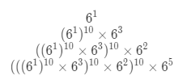

# 372. 超级次方

```c++
你的任务是计算 ab 对 1337 取模，a 是一个正整数，b 是一个非常大的正整数且会以数组形式给出。

示例 1:

输入: a = 2, b = [3]
输出: 8
示例 2:

输入: a = 2, b = [1,0]
输出: 1024

来源：力扣（LeetCode）
链接：https://leetcode-cn.com/problems/super-pow
著作权归领扣网络所有。商业转载请联系官方授权，非商业转载请注明出处。
```

---

快速幂+求模运算规律

6^1325 = 6^1000 ×6^300 ×6^20 ×6^5

仿照快速幂可以快速求解

（相当于快速幂用两次）



```c++
class Solution {
public:
	int superPow(int a, vector<int>& b) {
		int ans = 1;
		a %= 1337;

		vector<int> table(10, 0);
		for (int i = 0; i < 10; i++) {
			table[i] = myPow(a, i);
		}
		for (int t : b) {
			ans = (myPow(ans, 10) * table[t]) % 1337;
		}
		return ans;
	}

	int myPow(int a, int n) {
		int ans = 1;
		while (n > 0) {
			if ((n & 1) == 1) {
				ans = (ans * a) % 1337;
			}
			a = (a * a) % 1337;
			n >>= 1;
		}
		return ans;
	}

};
```

---

构建一个长度为10的表，存储t从0到9过程中myPow(a, t)的值还可以节省一点计算时间。

如果b的长度很大很大，再建一个长度为1337左右的表存储myPow(ans, 10)的结果会更快，到对于小规模的问题，建表时间太长所以得不偿失。


