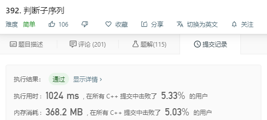

# 392-判断子序列

```c++
给定字符串 s 和 t ，判断 s 是否为 t 的子序列。

你可以认为 s 和 t 中仅包含英文小写字母。字符串 t 可能会很长（长度 ~= 500,000），而 s 是个短字符串（长度 <=100）。

字符串的一个子序列是原始字符串删除一些（也可以不删除）字符而不改变剩余字符相对位置形成的新字符串。（例如，"ace"是"abcde"的一个子序列，而"aec"不是）。

示例 1:
s = "abc", t = "ahbgdc"

返回 true.

示例 2:
s = "axc", t = "ahbgdc"

返回 false.

后续挑战 :

如果有大量输入的 S，称作S1, S2, ... , Sk 其中 k >= 10亿，你需要依次检查它们是否为 T 的子序列。在这种情况下，你会怎样改变代码？

来源：力扣（LeetCode）
链接：https://leetcode-cn.com/problems/is-subsequence
著作权归领扣网络所有。商业转载请联系官方授权，非商业转载请注明出处。
```

---

贪心算法

```c++
class Solution {
public:
    bool isSubsequence(string s, string t) {
        int len1 = s.size(),len2 = t.size();
        if(len1 == 0)
            return true;
        if(len2 == 0)
            return false;
        int i=0,j=0;
        while(1){
            if(s[i] == t[j]){
                i++;
                j++;
            }else{
                j++;
            }
            
            if(i == len1)
                return true;
            if(j == len2)
                return false;
        }
    }
};
```

---

## 对后续挑战的一些思考

>如果有大量输入的 S，称作S1, S2, ... , Sk 其中 k >= 10亿，你需要依次检查它们是否为 T 的子序列。在这种情况下，你会怎样改变代码？

这种类似对同一个长字符串做很多次匹配的 ，可以像KMP算法一样，先用一些时间将长字符串中的数据**提取出来**，磨刀不误砍柴功。有了提取好的数据，就可以快速的进行匹配。

### 1.我们需要提取什么样的数据

这道题其实是贪心算法，上面的整个算法很简单，容易理解（是因为人都是贪心的吗233）。 这里需要的数据就是匹配到某一点时 待匹配的字符在长字符串中**下一次**出现的位置。

所以我们前期多做一点工作，将长字符串研究透彻，假如长字符串的长度为n，建立一个n * 26 大小的矩阵，表示每个位置上26个字符下一次出现的位置。实现如下：

```c++
vector<vector<int> > dp(len2 , vector<int>(26, 0));

for (char c = 'a'; c <= 'z'; c++) {
    int nextPos = -1; //表示接下来再不会出现该字符

    for (int i = len2 - 1; i>= 0; i--) {  //为了获得下一个字符的位置，要从后往前
        dp[i][c - 'a'] = nextPos;
        if (t[i] == c)
            nextPos = i;
    }
}
```

### 2.数据的利用

对于要匹配的短字符串，遍历每一个字符，不断地寻找该字符在长字符串中的位置，然后将位置更新，寻找下一个字符，相当于在长字符串上“跳跃”。

如果下一个位置为`-1`，表示长字符串再没有该字符了，返回`false`即可。

### 3.需要注意的一点

对于`"abc"`在`"ahbgdc"`上匹配的时候，由于长字符串第一个`a`的下一个出现`a`的位置为-1（不出现），会导致一个bug。

所以在生成数组时在长字符串前插入一个空字符即可。

### 4.完整实现

```c++
class Solution {
public:
	bool isSubsequence(string s, string t) {
		t.insert(t.begin(), ' ');
		int len1 = s.size(), len2 = t.size();
		
		vector<vector<int> > dp(len2 , vector<int>(26, 0));

		for (char c = 'a'; c <= 'z'; c++) {
			int nextPos = -1; //表示接下来再不会出现该字符

			for (int i = len2 - 1; i>= 0; i--) {  //为了获得下一个字符的位置，要从后往前
				dp[i][c - 'a'] = nextPos;
				if (t[i] == c)
					nextPos = i;
			}
		}

		int index = 0;
		for (char c : s) {
			index = dp[index][c - 'a'];
			if (index == -1)
				return false;
		}
		return true;

	}
};

```

---

结果 O.O


