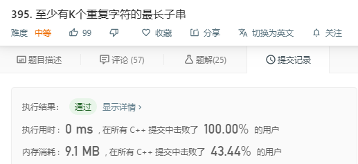

# 395. 至少有K个重复字符的最长子串

```c++
找到给定字符串（由小写字符组成）中的最长子串 T ， 要求 T 中的每一字符出现次数都不少于 k 。输出 T 的长度。

示例 1:

输入:
s = "aaabb", k = 3

输出:
3

最长子串为 "aaa" ，其中 'a' 重复了 3 次。
示例 2:

输入:
s = "ababbc", k = 2

输出:
5

最长子串为 "ababb" ，其中 'a' 重复了 2 次， 'b' 重复了 3 次。

来源：力扣（LeetCode）
链接：https://leetcode-cn.com/problems/longest-substring-with-at-least-k-repeating-characters
著作权归领扣网络所有。商业转载请联系官方授权，非商业转载请注明出处。
```

---

递归分治

其实还有优化空间，就是这个代码已经 0ms 100%了




可以优化的方向：

1. 每次调用函数的时候将所有不够k次的字符都作为分割点

2. 经过分割后有些段的总长度已经不够前面段返回的值，直接不进入该段

```c++
class Solution {
public:
    int longestSubstring(string s, int k) {
        if (k <= 1) 
            return s.size();
        if (s.empty() || s.size() < k) 
            return 0;
        
        vector<int> hash(128, 0);
        for (char c : s) 
            hash[c]++;
        
        int i = 0;
        while (i < s.size() && hash[s[i]] >= k) 
            i++;
        if (i == s.size()) 
            return s.size();

        int l = longestSubstring(s.substr(0, i), k);
        while (i < s.size() && hash[s[i]] < k) 
            i++;
        int r = longestSubstring(s.substr(i), k);
        
        return max(l, r);
    }
};
```

---


