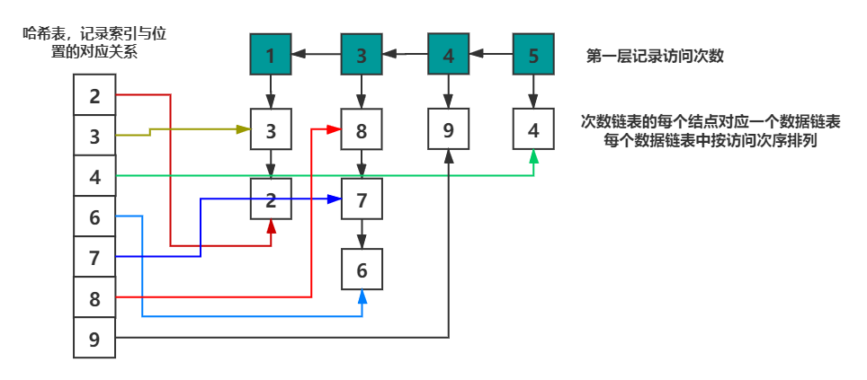

# 460. LFU缓存

```c++
设计并实现最不经常使用（LFU）缓存的数据结构。它应该支持以下操作：get 和 put。

get(key) - 如果键存在于缓存中，则获取键的值（总是正数），否则返回 -1。
put(key, value) - 如果键不存在，请设置或插入值。当缓存达到其容量时，它应该在插入新项目之前，使最不经常使用的项目无效。在此问题中，当存在平局（即两个或更多个键具有相同使用频率）时，最近最少使用的键将被去除。

进阶：
你是否可以在 O(1) 时间复杂度内执行两项操作？

示例：

LFUCache cache = new LFUCache( 2 /* capacity (缓存容量) */ );

cache.put(1, 1);
cache.put(2, 2);
cache.get(1);       // 返回 1
cache.put(3, 3);    // 去除 key 2
cache.get(2);       // 返回 -1 (未找到key 2)
cache.get(3);       // 返回 3
cache.put(4, 4);    // 去除 key 1
cache.get(1);       // 返回 -1 (未找到 key 1)
cache.get(3);       // 返回 3
cache.get(4);       // 返回 4

来源：力扣（LeetCode）
链接：https://leetcode-cn.com/problems/lfu-cache
著作权归领扣网络所有。商业转载请联系官方授权，非商业转载请注明出处。
```

---

我承认这一题抄的官方代码，但是我有很努力的在看解析。（>< 。 ><）

一图胜千言（来自[@time-limit](https://leetcode-cn.com/problems/lfu-cache/solution/c-ji-yu-unordered_maplist-shi-xian-o1-shi-jian-fu-/)）



我觉得最上面的蓝色链表箭头好像指反了（从小指大或者直接用双向链表）

```c++
// 缓存的节点信息
struct Node {
    int key, val, freq;
    Node(int _key,int _val,int _freq): key(_key), val(_val), freq(_freq){}
};
class LFUCache {
    int minfreq, capacity;
    unordered_map<int, list<Node>::iterator> key_table;
    unordered_map<int, list<Node>> freq_table;
public:
    LFUCache(int _capacity) {
        minfreq = 0;
        capacity = _capacity;
        key_table.clear();
        freq_table.clear();
    }
    
    int get(int key) {
        if (capacity == 0) return -1;
        auto it = key_table.find(key);
        if (it == key_table.end()) return -1;
        list<Node>::iterator node = it -> second;
        int val = node -> val, freq = node -> freq;
        freq_table[freq].erase(node);
        // 如果当前链表为空，我们需要在哈希表中删除，且更新minFreq
        if (freq_table[freq].size() == 0) {
            freq_table.erase(freq);
            if (minfreq == freq) minfreq += 1;
        }
        // 插入到 freq + 1 中
        freq_table[freq + 1].push_front(Node(key, val, freq + 1));
        key_table[key] = freq_table[freq + 1].begin();
        return val;
    }
    
    void put(int key, int value) {
        if (capacity == 0) return;
        auto it = key_table.find(key);
        if (it == key_table.end()) {
            // 缓存已满，需要进行删除操作
            if (key_table.size() == capacity) {
                // 通过 minFreq 拿到 freq_table[minFreq] 链表的末尾节点
                auto it2 = freq_table[minfreq].back();
                key_table.erase(it2.key);
                freq_table[minfreq].pop_back();
                if (freq_table[minfreq].size() == 0) {
                    freq_table.erase(minfreq);
                }
            } 
            freq_table[1].push_front(Node(key, value, 1));
            key_table[key] = freq_table[1].begin();
            minfreq = 1;
        } else {
            // 与 get 操作基本一致，除了需要更新缓存的值
            list<Node>::iterator node = it -> second;
            int freq = node -> freq;
            freq_table[freq].erase(node);
            if (freq_table[freq].size() == 0) {
                freq_table.erase(freq);
                if (minfreq == freq) minfreq += 1;
            }
            freq_table[freq + 1].push_front(Node(key, value, freq + 1));
            key_table[key] = freq_table[freq + 1].begin();
        }
    }
};


```

---


