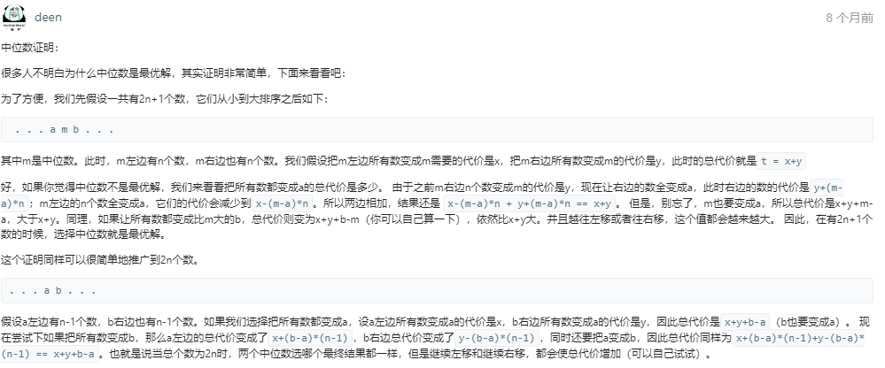

# 462-最少移动次数使数组元素相等 II

```c++
给定一个非空整数数组，找到使所有数组元素相等所需的最小移动数，其中每次移动可将选定的一个元素加1或减1。 您可以假设数组的长度最多为10000。

例如:

输入:
[1,2,3]

输出:
2

说明：
只有两个动作是必要的（记得每一步仅可使其中一个元素加1或减1）： 

[1,2,3]  =>  [2,2,3]  =>  [2,2,2]

来源：力扣（LeetCode）
链接：https://leetcode-cn.com/problems/minimum-moves-to-equal-array-elements-ii
著作权归领扣网络所有。商业转载请联系官方授权，非商业转载请注明出处。
```

---

看到@deen写的很好,学习一波



---

本来是选取中位数然后相减取绝对值，累加的。

其实可以写成如下，细品（设中位数为`M`， 在`M`之前前期是`M - nums[i]`，之后是`nums[j] - M` ，一抵消，直接  `nums[j] - nums[i]` 就行）

```c++
class Solution {
public:
    int minMoves2(vector<int>& nums) {
        int ans =0;
        int left = 0, right = nums.size() - 1;
        sort(nums.begin(), nums.end());
        while(left < right) {
            ans += nums[right--] - nums[left++];
        }
        return ans;
    }
};

```

---


