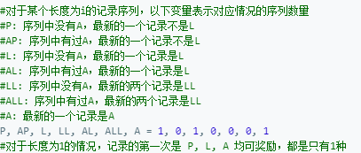

# 552. 学生出勤记录 II

```c++

```

---

参考大佬的代码。容易想到的迭代，但是代码能写的这么精简还是强



```c++
class Solution {
public:
    int checkRecord(int n) {
        int M = pow(10,9) + 7;
        if(!n) return 1;
        
        long P =1, AP = 0,L=1,LL=0,AL=0,ALL=0,A=1;
        long Pt, APt,Lt,LLt,ALt,ALLt,At;
        for(int i=2;i<=n;i++){
            Pt = (P+L+LL)%M;
            APt = ((AP + AL + ALL + A) % M);
            Lt = P;
            LLt = L;
            ALt =  (AP + A) % M;
            ALLt = AL;
            At = (P + L + LL) % M;
            
            P=Pt,AP= APt,L=Lt,LL=LLt,AL=ALt,ALL=ALLt,A=At;
        }
        return (P + AP + L + LL + AL + ALL + A) % M;
    }
};
```

---


