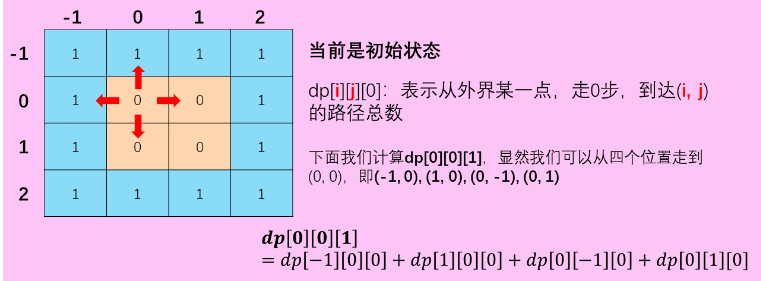
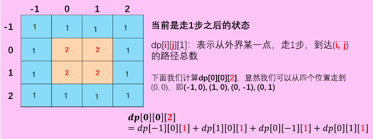

# 576. 出界的路径数

```c++
给定一个 m × n 的网格和一个球。球的起始坐标为 (i,j) ，你可以将球移到相邻的单元格内，或者往上、下、左、右四个方向上移动使球穿过网格边界。但是，你最多可以移动 N 次。找出可以将球移出边界的路径数量。答案可能非常大，返回 结果 mod 109 + 7 的值。

 

示例 1：

输入: m = 2, n = 2, N = 2, i = 0, j = 0
输出: 6
解释:

示例 2：

输入: m = 1, n = 3, N = 3, i = 0, j = 1
输出: 12
解释:

 

说明:

球一旦出界，就不能再被移动回网格内。
网格的长度和高度在 [1,50] 的范围内。
N 在 [0,50] 的范围内。

来源：力扣（LeetCode）
链接：https://leetcode-cn.com/problems/out-of-boundary-paths
著作权归领扣网络所有。商业转载请联系官方授权，非商业转载请注明出处。
```

---

很经典的迭代，dp，或者说是状态转移题，最近和这一道题做法比较相似的有哪个PLA缺勤考核的问题。

本来我的想法是正向迭代，最后统计出边界的所有元素之和。发现代码比较繁琐，就不贴出来了。

解析区看到大神是这样做的，逆向迭代。

先将原数组用一圈1围住，表示出了边界，然后循环时每次都是将元素的四周加起来，变为元素的新值。

最后的结果就是开始元素位置上的值。

很巧妙。


图片来自[Christmas_wang](https://leetcode-cn.com/problems/out-of-boundary-paths/solution/zhuang-tai-ji-du-shi-zhuang-tai-ji-by-christmas_wa/)

有修改。





```c++
class Solution {
public:
    int findPaths(int m, int n, int N, int i, int j) {
        long dp[53][53][2] ={0};
        for(int i=0;i<m+2;i++){
            dp[i][0][0] = dp[i][0][1] =1;
            dp[i][n+1][0] = dp[i][n+1][1] =1;
        }
        for(int j=0;j<n+2;j++){
            dp[0][j][0] = dp[0][j][1] =1;
            dp[m+1][j][0] = dp[m+1][j][1] =1;
        }
        
        for(int k= 0; k<N; k++){
            int t = k%2;
            for(int i=1;i<m+1;i++){
                for(int j=1;j<n+1;j++){
                    
                    dp[i][j][t] = (dp[i + 1][j][!t] + dp[i - 1][j][!t] + dp[i][j + 1][!t] + dp[i][j - 1][!t]) % 1000000007;
                }
            }
        }
        
        return dp[i + 1][j + 1][!(N%2)];
    }
};
```

---


