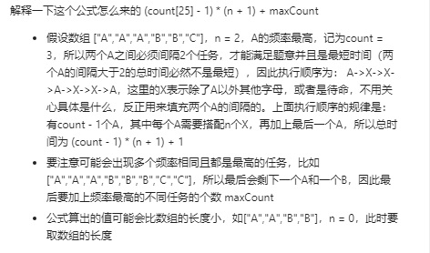

# 621. 任务调度器

```c++
给定一个用字符数组表示的 CPU 需要执行的任务列表。其中包含使用大写的 A - Z 字母表示的26 种不同种类的任务。任务可以以任意顺序执行，并且每个任务都可以在 1 个单位时间内执行完。CPU 在任何一个单位时间内都可以执行一个任务，或者在待命状态。

然而，两个相同种类的任务之间必须有长度为 n 的冷却时间，因此至少有连续 n 个单位时间内 CPU 在执行不同的任务，或者在待命状态。

你需要计算完成所有任务所需要的最短时间。

示例 1：

输入: tasks = ["A","A","A","B","B","B"], n = 2
输出: 8
执行顺序: A -> B -> (待命) -> A -> B -> (待命) -> A -> B.
注：

任务的总个数为 [1, 10000]。
n 的取值范围为 [0, 100]。

来源：力扣（LeetCode）
链接：https://leetcode-cn.com/problems/task-scheduler
著作权归领扣网络所有。商业转载请联系官方授权，非商业转载请注明出处。
```

---

没看评论就想到的最优解法，我也太强了把。

懒得写注释了，截一个评论区的高赞图。



```c++
class Solution {
public:
    int leastInterval(vector<char>& tasks, int n) {
        int mp[128] = {0};
        int mx = 0,ans = 0,len = tasks.size();
        for(char c :tasks){
            mp[c]++;
            mx = max(mx, mp[c]);
        }
        int cc= 0;
        for(int i=0;i<128;i++){
            if(mp[i] == mx)
                cc++;
        }
        
        return max((mx -1 )*(n + 1) +cc, len);
    }
};
```

---


