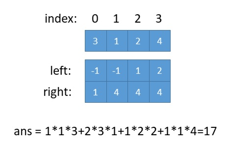

# 907. 子数组的最小值之和

```c++
给定一个整数数组 A，找到 min(B) 的总和，其中 B 的范围为 A 的每个（连续）子数组。

由于答案可能很大，因此返回答案模 10^9 + 7。

 

示例：

输入：[3,1,2,4]
输出：17
解释：
子数组为 [3]，[1]，[2]，[4]，[3,1]，[1,2]，[2,4]，[3,1,2]，[1,2,4]，[3,1,2,4]。 
最小值为 3，1，2，4，1，1，2，1，1，1，和为 17。
 

提示：

1 <= A <= 30000
1 <= A[i] <= 30000

来源：力扣（LeetCode）
链接：https://leetcode-cn.com/problems/sum-of-subarray-minimums
著作权归领扣网络所有。商业转载请联系官方授权，非商业转载请注明出处。
```

---

看了大佬[@刘岳](https://leetcode-cn.com/u/smoon1989/)的解题，真的是容易理解。

> 考虑从A中的每个元素A[i]，如果求出包含A[i]并以A[i]为最小元素的所有子数组个数n[i]，则元素A[i]对答案ans的贡献为n[i]*A[i]，那么我们可以先求包含A[i]并以A[i]为最小元素的最长子数组，如果A[i]左边第一个小于A[i]的元素为A[left]，A[i]右边第一个小于A[i]的元素为A[right]，则包含A[i]并以A[i]为最小元素的最长子数组为A[left+1:right]，满足以A[i]为最小元素的所有子数组个数n[i] = (i-left)*(right-i)。我们用left[i]表示A[i]左边第一个小于A[i]元素的位置，用right[i]表示A[i]右边第一个小于A[i]元素的位置，left数组初始值为-1，right数组初始值为len(A)，求解left和right可以用单调栈来实现，可以两遍遍历，也可以一遍遍历，更优化的写法还可以一边遍历一边求解ans。

时间复杂度O(N)O(N)

空间复杂度O(N)O(N)



```c++
class Solution {
public:
    int sumSubarrayMins(vector<int>& A) {
        int len = A.size();
        vector<int> left(len, 0);
        vector<int> right(len, 0);
        left[0] = -1;
        right[len - 1] = len;
        for (int i = 0; i < len; i++) {
            int l = i - 1;
            while (l >= 0 && A[l] > A[i]) //可以优化为dp
                l = left[l];
            left[i] = l;
        }
        for (int i = len - 1; i >= 0; i--) {
            int r = i + 1;
            while (r < len && A[r] >= A[i])//可以优化为dp
                r = right[r];
            right[i] = r;
        }
        int ans = 0;
        int M = 1000000007;
        for (int i = 0; i < len; i++){
            ans += (i - left[i]) * (right[i] - i) * A[i];
            ans %= M;
        }
 
        return ans;
    }
};
```

---
