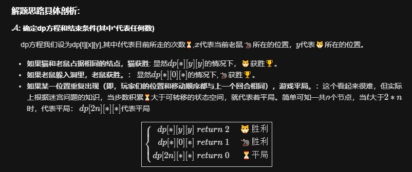

# 913. 猫和老鼠

```c++
两个玩家分别扮演猫（Cat）和老鼠（Mouse）在无向图上进行游戏，他们轮流行动。

该图按下述规则给出：graph[a] 是所有结点 b 的列表，使得 ab 是图的一条边。

老鼠从结点 1 开始并率先出发，猫从结点 2 开始且随后出发，在结点 0 处有一个洞。

在每个玩家的回合中，他们必须沿着与他们所在位置相吻合的图的一条边移动。例如，如果老鼠位于结点 1，那么它只能移动到 graph[1] 中的（任何）结点去。

此外，猫无法移动到洞（结点 0）里。

然后，游戏在出现以下三种情形之一时结束：

如果猫和老鼠占据相同的结点，猫获胜。
如果老鼠躲入洞里，老鼠获胜。
如果某一位置重复出现（即，玩家们的位置和移动顺序都与上一个回合相同），游戏平局。
给定 graph，并假设两个玩家都以最佳状态参与游戏，如果老鼠获胜，则返回 1；如果猫获胜，则返回 2；如果平局，则返回 0。

 

示例：

输入：[[2,5],[3],[0,4,5],[1,4,5],[2,3],[0,2,3]]
输出：0
解释：
4---3---1
|   |
2---5
 \ /
  0
 

提示：

3 <= graph.length <= 200
保证 graph[1] 非空。
保证 graph[2] 包含非零元素。

来源：力扣（LeetCode）
链接：https://leetcode-cn.com/problems/cat-and-mouse
著作权归领扣网络所有。商业转载请联系官方授权，非商业转载请注明出处。
```

---

思路来源[@wen-mu-yang](https://leetcode-cn.com/problems/cat-and-mouse/solution/c-si-lu-pou-xi-3-dpjie-jue-bo-yi-ce-lue-zui-jia-zh/)



```c++
class Solution {
public:
    int n;
    int catMouseGame(vector<vector<int>>& graph) {
        n = graph.size();
        short dp[400][200][200]; //dp[i][j][k] 表示第n步时，老鼠的位置在j，猫的位置在k 时游戏的输赢
        memset(dp, -1, sizeof(dp));
        return helper(0, 1, 2, dp, graph);
    }

    int helper(int step, int mou, int cat, short dp[][200][200], vector<vector<int>>& graph) {
        if (step == 2 * n) return 0; //超出步数，陷入循环，直接返回平局
        if (mou == cat) return 2; //位置重叠， 猫赢
        if (mou == 0) return 1; // 老鼠赢
        if (dp[step][mou][cat] != -1) return dp[step][mou][cat];

        int ans = 2;
        if (step % 2 == 0) {
            // 老鼠的回合
            for (int i = 0; i < graph[mou].size(); i++) {
                int t = helper(step + 1, graph[mou][i], cat, dp, graph);
                if (t == 1) {
                    ans = 1;
                    break;
                }
                if (t != 2) ans = 0;
            }
        }
        else {
            // 猫的回合
            ans = 1;
            for (int i = 0; i < graph[cat].size(); i++) {
                int nxt = graph[cat][i];
                if (nxt == 0) continue;
                int t = helper(step + 1, mou, graph[cat][i], dp, graph);
                if (t == 2) {
                    ans = 2;
                    break;
                }
                if (t != 1) ans = 0;
            }
        }
        dp[step][mou][cat] = ans;
        return ans;

    }
};
```

---
