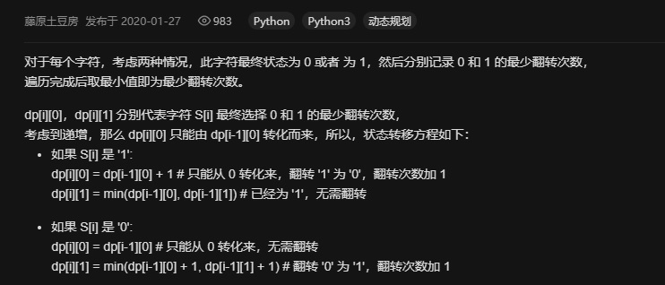

# 926. 将字符串翻转到单调递增

```c++
如果一个由 '0' 和 '1' 组成的字符串，是以一些 '0'（可能没有 '0'）后面跟着一些 '1'（也可能没有 '1'）的形式组成的，那么该字符串是单调递增的。

我们给出一个由字符 '0' 和 '1' 组成的字符串 S，我们可以将任何 '0' 翻转为 '1' 或者将 '1' 翻转为 '0'。

返回使 S 单调递增的最小翻转次数。

 

示例 1：

输入："00110"
输出：1
解释：我们翻转最后一位得到 00111.
示例 2：

输入："010110"
输出：2
解释：我们翻转得到 011111，或者是 000111。
示例 3：

输入："00011000"
输出：2
解释：我们翻转得到 00000000。
 

提示：

1 <= S.length <= 20000
S 中只包含字符 '0' 和 '1'

来源：力扣（LeetCode）
链接：https://leetcode-cn.com/problems/flip-string-to-monotone-increasing
著作权归领扣网络所有。商业转载请联系官方授权，非商业转载请注明出处。
```

---

设计很巧妙的一道题，刚开始看题目的时候就想着找到一个分界点，使得该分界点之前1的个数和分界点之后0的个数之和最小

这样用一个辅助数组存1的个数，然后第二次遍历的时候从后往前，再扫描一遍即可。

缺点是空间复杂度较高，看了题解以后发现还有不使用额外空间的解法。就是dp

图片来源于解题区：



```c++
class Solution {
public:
    int minFlipsMonoIncr(string S) {
        int z = 0, o = 0;
        int len = S.size();
        for(int i=0;i<len;i++){
            if(S[i] == '0')
                o = min(z, o) + 1;
            else{
                o = min(z, o);
                z = z + 1;
            }
        }
        return min(z,o);
    }
};
```

---
