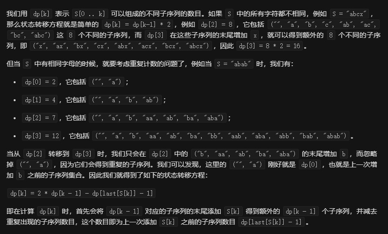

# 940. 不同的子序列 II

```c++

给定一个字符串 S，计算 S 的不同非空子序列的个数。

因为结果可能很大，所以返回答案模 10^9 + 7.

 

示例 1：

输入："abc"
输出：7
解释：7 个不同的子序列分别是 "a", "b", "c", "ab", "ac", "bc", 以及 "abc"。
示例 2：

输入："aba"
输出：6
解释：6 个不同的子序列分别是 "a", "b", "ab", "ba", "aa" 以及 "aba"。
示例 3：

输入："aaa"
输出：3
解释：3 个不同的子序列分别是 "a", "aa" 以及 "aaa"。
 

 

提示：

S 只包含小写字母。
1 <= S.length <= 2000
```

---

注意这道题要求的是**不同**非空**子序列**的个数，可以使用动态规划的方法。

用`dp[k]`表示前k个字符可以组成的数目，状态转移方程为：

`dp[k] = 2 * dp[k - 1] - dp[last[S[k]] - 1]`

`last[i]`表示对应位置上的字符前一个出现的位置。



```c++
class Solution {
public:
    int distinctSubseqII(string S) {
        int M = 1e9+7;
        int len = S.size();
        vector<long> dp(len+1, 0);
        dp[0] = 1; //表示 “”  空字符串
        int t[26];
        memset(t, -1, sizeof(t));
        int last[2000] = {0};
        for(int i=0;i<len;i++){
            last[i] = t[S[i]- 'a'];
            t[S[i]-'a'] = i;
        }

        for(int i=0;i<len;i++){
            dp[i+1] = dp[i]*2 + M - ((last[i] == -1) ? 0 : dp[last[i]] );
            dp[i+1] %= M;
        }
        return dp[len] - 1;
    }
};
```

---
