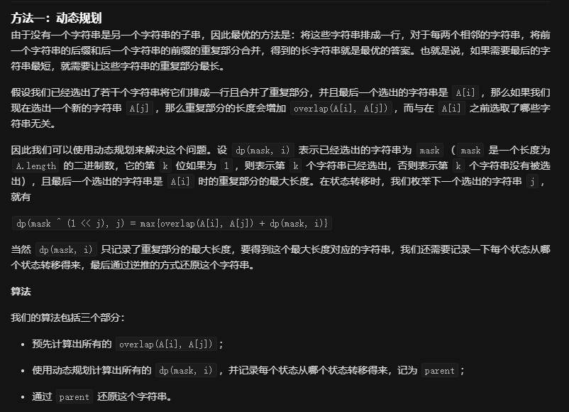

# 943. 最短超级串

```c++
给定一个字符串数组 A，找到以 A 中每个字符串作为子字符串的最短字符串。

我们可以假设 A 中没有字符串是 A 中另一个字符串的子字符串。

 

示例 1：

输入：["alex","loves","leetcode"]
输出："alexlovesleetcode"
解释："alex"，"loves"，"leetcode" 的所有排列都会被接受。
示例 2：

输入：["catg","ctaagt","gcta","ttca","atgcatc"]
输出："gctaagttcatgcatc"
 

提示：

1 <= A.length <= 12
1 <= A[i].length <= 20

来源：力扣（LeetCode）
链接：https://leetcode-cn.com/problems/find-the-shortest-superstring
著作权归领扣网络所有。商业转载请联系官方授权，非商业转载请注明出处。
```

---

一道经典的状压dp，遍历每个状态，取最小值。

除此之外，还有这道题并不是问最短的数字是多少，而是问最短的字符串。

所以还需要使用一个path来记录每一步的决策，然后从后往前迭代的推出整个字符串

第一眼看着没想到这个方法，看了官方解题才恍然大悟。




```c++
class Solution {
public:
	string shortestSuperstring(vector<string>& A) {
		int len = A.size();
		int overlap[12][12] = {0};
		for (int i = 0; i < len; i++) {
			for (int j = 0; j < len; j++) {
				if (i == j) continue;
				int k = min(A[i].size(), A[j].size());
				for (; k >= 0; k--) {
					if (A[i].substr(A[i].size() - k , k) == A[j].substr(0, k)) {
						overlap[i][j] = k;
						break;
					}
				}
			}
		}

		vector<vector<int>> path(1 << len, vector<int>(len, -1));

		vector<vector<int>> dp(1 << len, vector<int>(len, 0x3f3f3f3f));
		dp[0] = vector<int>(len, 0);
		for (int i = 1; i < (1 << len); i++) {
			
			for (int j = 0; j < len; j++) {

				if ((1 << j) & i) { // 将该位作为最后添加的一位
					int bis = i ^ (1 << j);
					if (bis == 0) {
						dp[i][j] = A[j].size();
						
						break;
					}
					for (int k = 0; k < len; k++) {
						if (i == 30) {
							int aaaa = 0;
						}
						if ((1 << k) & bis) {
							if (dp[bis][k] + (int)A[j].size() - overlap[k][j] < dp[i][j]) {
								dp[i][j] = dp[bis][k] + (int)A[j].size() - overlap[k][j];
								path[i][j] = k;
							}
						}
					}
				}
			}
		}
		int t = INT_MAX;
		int beg = 0;
		for (int i = 0; i < len; i++) {
			if (dp[(1 << len) - 1][i] < t) {
				t =dp[(1 << len) - 1][i];
				beg = i;
			}
		}
		string ans = A[beg];
		t = (1 << len) - 1;
		while (--len) {
			int aa = beg;
			beg = path[t][beg];
			ans = A[beg].substr(0,A[beg].size() - overlap[beg][aa]) + ans;
			t = t ^ (1 << aa);
		}
		return ans;
	}
};
```

---
