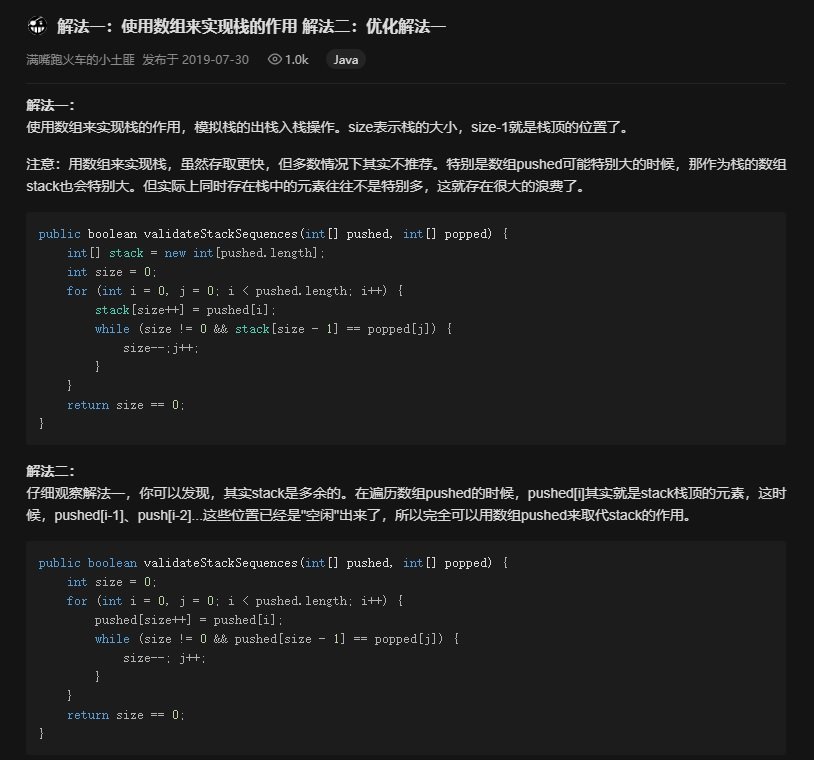

# 946. 验证栈序列

```c++
给定 pushed 和 popped 两个序列，每个序列中的 值都不重复，只有当它们可能是在最初空栈上进行的推入 push 和弹出 pop 操作序列的结果时，返回 true；否则，返回 false 。

 

示例 1：

输入：pushed = [1,2,3,4,5], popped = [4,5,3,2,1]
输出：true
解释：我们可以按以下顺序执行：
push(1), push(2), push(3), push(4), pop() -> 4,
push(5), pop() -> 5, pop() -> 3, pop() -> 2, pop() -> 1
示例 2：

输入：pushed = [1,2,3,4,5], popped = [4,3,5,1,2]
输出：false
解释：1 不能在 2 之前弹出。
 

提示：

0 <= pushed.length == popped.length <= 1000
0 <= pushed[i], popped[i] < 1000
pushed 是 popped 的排列。

来源：力扣（LeetCode）
链接：https://leetcode-cn.com/problems/validate-stack-sequences
著作权归领扣网络所有。商业转载请联系官方授权，非商业转载请注明出处。
```

---

用一个栈模拟，和之前的一道题很想

```c++
class Solution {
public:
    bool validateStackSequences(vector<int>& pushed, vector<int>& popped) {
        int len = pushed.size();
        if(len == 0) return true;
        stack<int> s;
        int i = 0,  j =0 ;
        while(1){
            if(s.empty() || s.top() !=  popped[j]){
                if(i == len) return false;
                s.push(pushed[i++]);
            }
            else{
                j++;
                s.pop();
                if(j == len) return true;
            }
        }
        return false;
    }
    
};
```

---

更加简练的写法：


