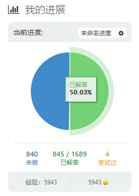
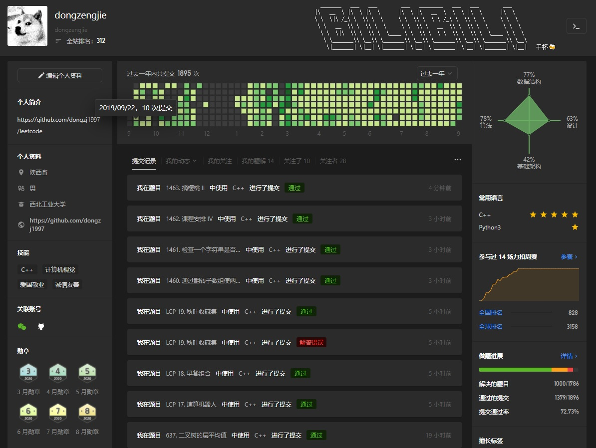
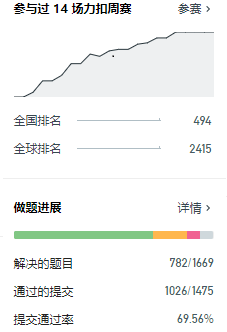
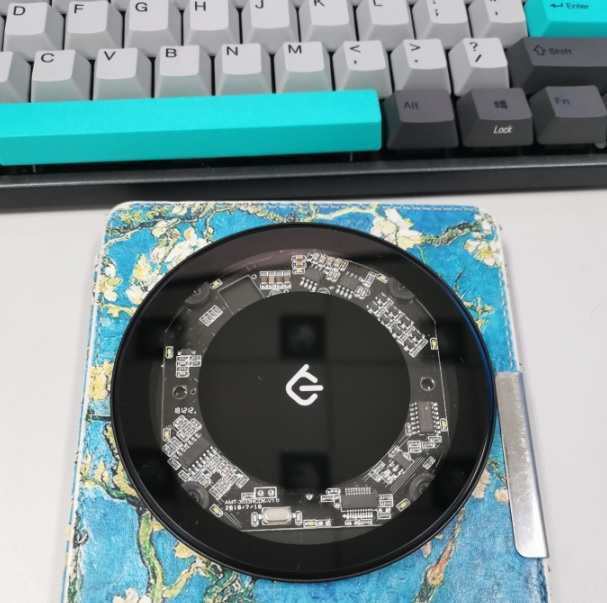

# leetcode

我的`LeetCode`主页：[@dongzengjie](https://leetcode-cn.com/u/dongzengjie/)

不定期发布leetcode解题思路和代码

## 一些好的题目

### 动态规划

|  一般dp  | 区间dp|  位数dp |  状压dp| 树形DP|
|  ----   | ----  | ----  |----  | --- | 
| [1092. 最短公共超序列](https://github.com/dongzj1997/leetcode/tree/master/1001~1100/1092.%20%E6%9C%80%E7%9F%AD%E5%85%AC%E5%85%B1%E8%B6%85%E5%BA%8F%E5%88%97)   | [1039. 多边形三角剖分的最低得分](https://github.com/dongzj1997/leetcode/tree/master/1001~1100/1039.%20%E5%A4%9A%E8%BE%B9%E5%BD%A2%E4%B8%89%E8%A7%92%E5%89%96%E5%88%86%E7%9A%84%E6%9C%80%E4%BD%8E%E5%BE%97%E5%88%86) | [902. 最大为 N 的数字组合](https://github.com/dongzj1997/leetcode/tree/master/901~1000/902.%20%E6%9C%80%E5%A4%A7%E4%B8%BA%20N%20%E7%9A%84%E6%95%B0%E5%AD%97%E7%BB%84%E5%90%88#902-%E6%9C%80%E5%A4%A7%E4%B8%BA-n-%E7%9A%84%E6%95%B0%E5%AD%97%E7%BB%84%E5%90%88) | [943. 最短超级串](https://github.com/dongzj1997/leetcode/tree/master/901~1000/943.%20%E6%9C%80%E7%9F%AD%E8%B6%85%E7%BA%A7%E4%B8%B2)  | |
|[★1406. 石子游戏 III](https://leetcode-cn.com/problems/stone-game-iii/solution/pao-zhuan-yin-yu-fa-ge-jie-ti-c-dp-by-dongzengjie/) | [1000. 合并石头的最低成本 (very hard)](https://github.com/dongzj1997/leetcode/tree/master/901~1000/1000.%20%E5%90%88%E5%B9%B6%E7%9F%B3%E5%A4%B4%E7%9A%84%E6%9C%80%E4%BD%8E%E6%88%90%E6%9C%AC)  |  |   |  |
| | [★ 08.14. 布尔运算](https://leetcode-cn.com/problems/boolean-evaluation-lcci/solution/shi-yong-dai-bei-wang-lu-de-di-gui-ji-suan-jie-guo/) | | | |

### 树

|  二叉树  | 前缀树 |  -- |  其他树上问题 |
|  ----   | ----  | ----  |----  |
|  [968. 监控二叉树](https://github.com/dongzj1997/leetcode/tree/master/901~1000/968.%20%E7%9B%91%E6%8E%A7%E4%BA%8C%E5%8F%89%E6%A0%91)   |[1032. 字符流](https://github.com/dongzj1997/leetcode/tree/master/1001~1100/1032.%20%E5%AD%97%E7%AC%A6%E6%B5%81) | ----  |----  |
|  [987. 二叉树的垂序遍历](https://github.com/dongzj1997/leetcode/tree/master/901~1000/987.%20%E4%BA%8C%E5%8F%89%E6%A0%91%E7%9A%84%E5%9E%82%E5%BA%8F%E9%81%8D%E5%8E%86)   | ----  | ----  |----  |
|  ----   | ----  | ----  |----  |

### 图

|  拓扑排序  | 最小生成树 |  最短路 | 联通分量 | 二分图 | 网络流  |
|  ----   | ----  | ----  |----  |----  |----  |

### 搜索

|  暴力搜索  | DFS |  BFS |  数组 |
|  ----   | ----  | ----  |----  |

### 其他算法/数据结构

|  位运算  | 并查集 |  二分 |  数组 |
|  ----   | ----  | ----  |----  |
|[982. 按位与为零的三元组](https://github.com/dongzj1997/leetcode/tree/master/901~1000/982.%20%E6%8C%89%E4%BD%8D%E4%B8%8E%E4%B8%BA%E9%9B%B6%E7%9A%84%E4%B8%89%E5%85%83%E7%BB%84)  | [959. 由斜杠划分区域](https://github.com/dongzj1997/leetcode/tree/master/901~1000/959.%20%E7%94%B1%E6%96%9C%E6%9D%A0%E5%88%92%E5%88%86%E5%8C%BA%E5%9F%9F)  | [★ 1011. 在 D 天内送达包裹的能力 ★](https://github.com/dongzj1997/leetcode/tree/master/1001~1100/1011.%20%E5%9C%A8%20D%20%E5%A4%A9%E5%86%85%E9%80%81%E8%BE%BE%E5%8C%85%E8%A3%B9%E7%9A%84%E8%83%BD%E5%8A%9B)  | [★1024. 视频拼接](https://leetcode-cn.com/problems/video-stitching/solution/0msshuang-bai-shi-yong-duo-xing-geng-xin-ce-lue-on/)  |
|  ----  | ----  | [★ 10.05. 稀疏数组搜索](https://leetcode-cn.com/problems/sparse-array-search-lcci/solution/shi-yong-er-fen-sou-suo-ti-gao-xiao-lu-by-dongzeng/)  |----  |

|  滑动窗口  | 递归  | 字符串 |  栈与队列（单调栈） |
|  ----   | ----  | ----  |----  |
| [★剑指 Offer 57 - II. 和为s的连续正数序列](https://leetcode-cn.com/problems/he-wei-sde-lian-xu-zheng-shu-xu-lie-lcof/solution/san-chong-fang-fa-cong-jian-dao-fan-zai-dao-jian-b/) | [★ 486. 预测赢家](https://leetcode-cn.com/problems/predict-the-winner/solution/chao-duan-zhe-ke-neng-shi-zui-jie-jin-zheng-chang-/) | [★ 392. 判断子序列](https://leetcode-cn.com/problems/is-subsequence/solution/dui-hou-xu-tiao-zhan-de-yi-xie-si-kao-ru-he-kuai-s/) | [★ 373. 查找和最小的K对数字](https://leetcode-cn.com/problems/find-k-pairs-with-smallest-sums/solution/8ms-100ji-lu-wei-zhi-zhi-zhen-kuai-su-qiu-jie-by-d/) |
||| | [★ 224. 基本计算器](https://leetcode-cn.com/problems/basic-calculator-ii/solution/qiao-yong-yun-suan-fu-you-xian-ji-biao-he-zhan-s-2/)|

|  堆  | 树状数组、线段树  | 跳表 |  哈希链表 |
|  ----   | ----  | ----  |----  |

---


## milestone

2020年6月9日，800题 √

2020年6月21日，在这个特别的日子里（不仅仅是日食），完成度`50%` √。



2020年9月12日，1000题 √



完成1000题的时候刚好是从0开始刷 **leetcode** **一周年**，感觉这一年编程和算法能力提升很大。

以后可能没有那么多时间花在**leetcode**上面了，刷题的频率会少一些，会侧重于论文或者其他计算机相关的知识和对之前做过的题目整理，有时间的话参加一下周赛啥的，话说自从开学我就再没参加过周赛了，排名都从430+掉到800+了。

刚好刷题一周年的时候碰上了**leetcode**秋季赛，个人感觉还不错，基本上会的题目都能在短时间内敲出来。

第一题和第二题送分，第三题有思路，结果dp数组初始化不完全WA了一发，第四题和之前做过的一题比较像[1553. 吃掉 N 个橘子的最少天数](https://leetcode-cn.com/problems/minimum-number-of-days-to-eat-n-oranges/)，主要思路都是递归，注意递归的时候让变量指成倍缩小，如果没有办法成倍缩小，就先在函数内进行加减操作。但是这个题细节很更多，并且取模有点干扰，前面一直在想取模以后的数组大小关系怎么比较，后面才反应过来其实用long long 是不越界的，可以直接进行比较，浪费了不少时间，调了半天总是有一点问题。最后看了一下排名，感觉排名还不错，就懒得再调了。第五题是图论，由于没受过专业的训练，所以图论一直不太会做，只知道用几个经典的算法（Floyd，djs等等），所以直接就放弃了。


## 周赛

前500 √



---

充电器 √



0ms 神秘代码：

```c++
static int x = []() {std::ios::sync_with_stdio(false); cin.tie(0); return 0; }();
```
